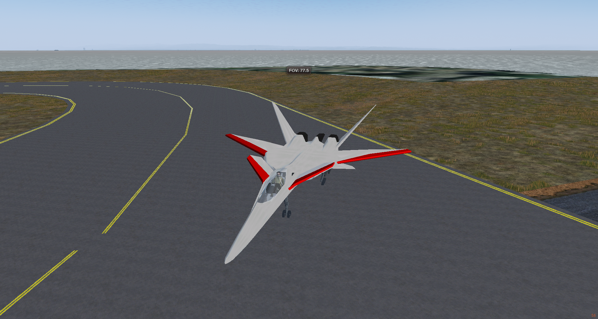

# XFA-27
An Advanced, cool looking XFA-27 From Ace combat 2 (tm) to Flightgear, 
 
# Now with damage on it! 
so you can shoot down your freinds in this or any OPRF damageable aircraft, F-16, Viggen, and sams too

Please dont use this in OPRF events, 

# To install:

Download and extract XFA-27-master into your aircraft folder, Rename to: XFA-27 
 
This is a Crazy Fighter jet based of my favorite video game series
This model toke me 2 Mounths to make, please star it if you like it :)

# Tell me more about this plane!

Ok! 

The XFA-27 is a carrier-based stealth fighter which has been developed with the aim of creating an aircraft that can demonstrate extreme performance in maneuverability, speed, and weaponry. Information on the country of origin and manufacturer has not been discovered yet, making this a Very highly classified aircraft. Featuring 4 all-moving tailrollvons, large canards, varible sweeping wings that auto sweep at 400 kts and unique vectoring nozzles, it is capable of Perfect maneuverability. It comes equipped with 2 Aim-9Z's, 8 Aim-120X's, and 4 HVALRAAM's (VA-7's) (High Velocity Advanced Long Range Air-Air Missile's, (Prounounced: Have-Ram, the L is silent)) which can inflict So much damage at super hyper sonic speeds (Mach 8), but requires the skills of a  pilot to use efficiently because its manuverability might be a little too high.

Keys: 
[ sweep wings out 
] sweep wings in

e Shoot guns

h Change hud color

Liverys coming soon! stay tuned!
